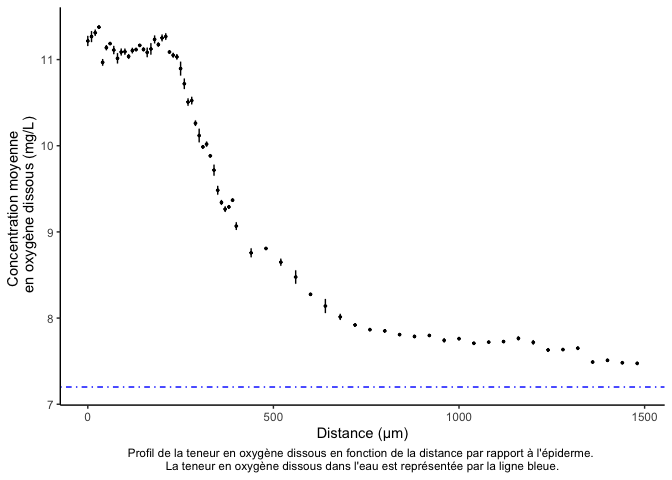

<!-- README.md is generated from README.Rmd. Please edit that file -->
Mise au point d'une microsonde optique à Oxygène
================================================

Auteurs / Authors
-----------------

-   [Guyliann Engels](https://github.com/GuyliannEngels)
-   Jesica Save Garrido

Directeur / Supervisor
----------------------

-   [Philippe Grosjean](https://github.com/phgrosjean)

Résumé
------

L'étude des réponses écophysiologiques des coraux à des stress par des méthodes non destructives et en mésocosmes (limite du nombre d'individus), requiert l'utilisation de techniques et d'outils particuliers. La mesure précise de la production d'oxygène localement via une [microsonde à oxygène](https://www.pyroscience.com/retractable-fiber-optic-oxygen-sensors.html)est un outils permettant de déterminer la photosynthèse.

Organisation
------------

Ce dépot couvre une partie des expériences réalisées par Jessica Save Garrido

en vue de l’obtention du grade académique du bachelier en agronomie orientation environnement durant l'année académique 2017-2018 portant le nom suivant :

-   Mise en place d’une technique de mesure de photosynthèse chez les coraux scléractiniaires : application à *Galaxea fascicularis* (L.) 1767

Le manuscrit de ce travail ce trouve dans le dossier `memoir` du dossier `analysis`. L'un des résultats particulièrement intéressant de ce travail est la variation de l' oxygène dissous en fonction de la distance par rapport à l'épiderme de la bouture.

News
----

Suite aux travaux de Jessica Save Garrido, il est décidé de mettre en suspend les travaux sur ces outils.
